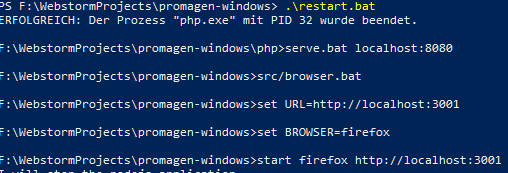
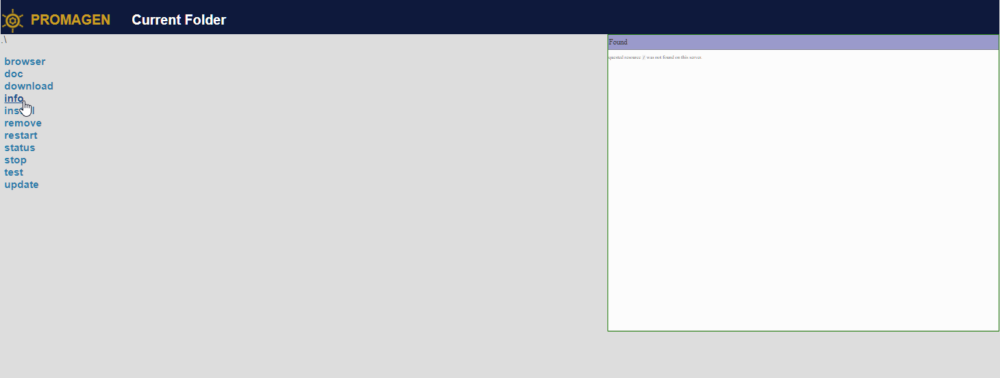
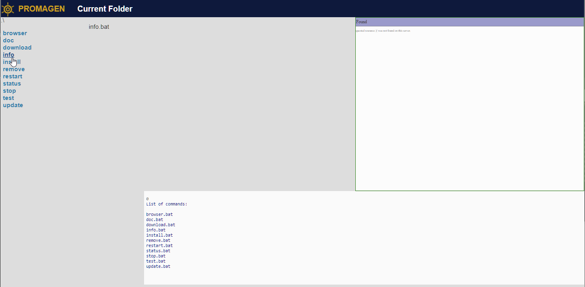
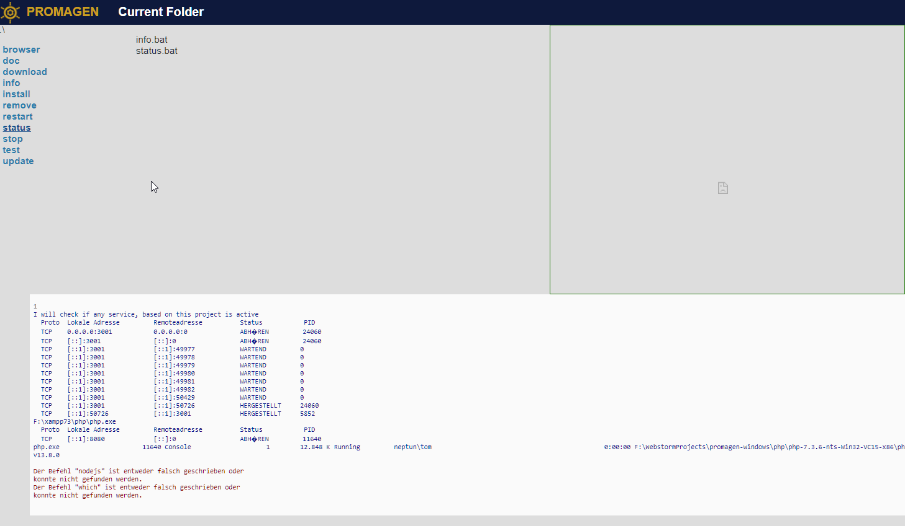
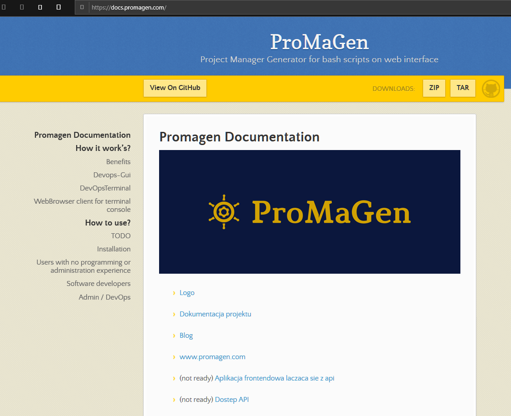
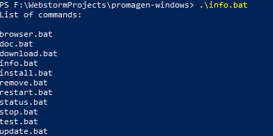
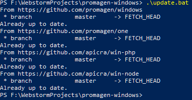

# [promagen/windows: Environment prepared to execute ProMaGen on windows OS](https://github.com/promagen/windows)

[ProMaGen](https://www.promagen.com) is a nodejs service to execute shell scripts by browser without terminal.
it's a WebUI tool for DevOps, give a chance to manage the project by browser.  
It's dedicated for daily work by developers on local development and for end users, during testing the test version.

## Example

This is example of usage [Apicra](https://www.apicra.com) and [Apiexec](https://www.apiexec.com) in [ProMaGen](https://www.promagen.com) application.

The concept based on [API Foundation](https://www.apifoundation.com/) ecosystem to execute fast as possible any application in any environment.

In this example we are using 3 packages:
+ sourcode of [promagen one](https://github.com/promagen/one.git)
+ apicra installer for [nodejs](https://github.com/apicra/win-node.git)
+ [php executor](https://github.com/apicra/win-php.git) for example service working on port 8080

At local development we are using some application based on localhost and in this example it's a PHP service just for a testing http://localhost:8080
The path for a executing the scripts is set on "../", the folder is currently used by this repository.
In Real usage, we are creating the structure of project such:

+ MainApp
    + src
    + docker
    + vendor
    + ... some files such composer.json

What we need add is just creating more scripts to execute by promagen,
we can use the all scripts here created and leave only

    restart.bat

To use it every time to restart our application, and another just to controll our docker or another services
at this point of view, we can control all folders inside the project by the scripts.

## required

+ [Git for Windows](https://gitforwindows.org/)
+ [Download Node.js for windows](https://nodejs.org/en/download/)

## Installation and start on windows

first download by git cloning the code:

    git clone https://github.com/promagen/windows.git promagen-win

go to the directory:

    cd promagen-win

and start working with ProMaGen by scripts:

    download.bat
    install.bat
    
    restart.bat

### start browser on  http://localhost:3001/
+ [ProMaGen One on http://localhost:3001](http://localhost:3001/)
+ [example PHP service just for a testing http://localhost:8080](http://localhost:8080/)

### start scripts on browser

## check in console

    doc.bat

    info.bat

## update

    update.bat

